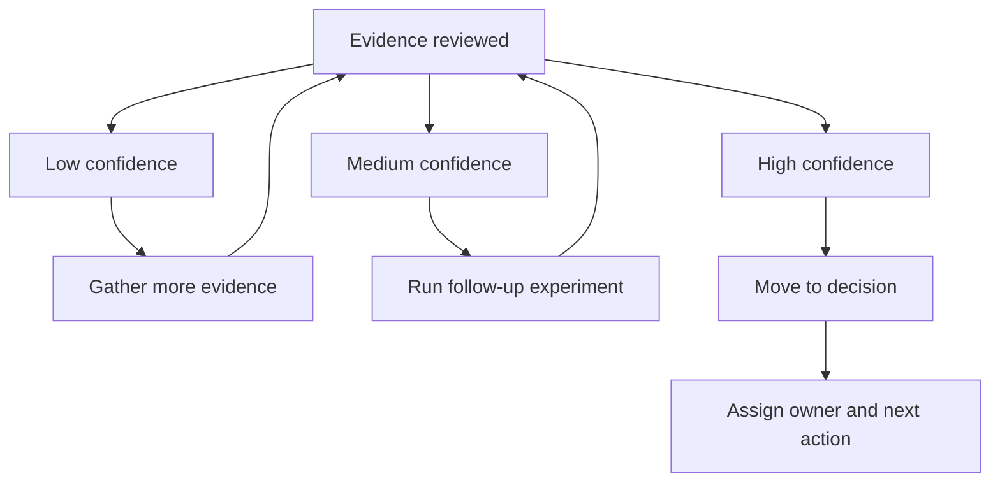

# Decision Quality Model

**Purpose**: Define how teams judge whether evidence is strong enough to decide.

## Outcome

Decisions become faster and more consistent without lowering quality.

This section exists because many teams do not struggle with generating options. They struggle with deciding when they have enough confidence to act, when they need more evidence, and how to avoid both premature decisions and endless delay.

## Decision standards by stage

- **Assumption stage**: assumptions are explicit, prioritized, and risk-ranked.
- **Hypothesis stage**: hypotheses are testable and measurable.
- **Experiment stage**: test design matches the hypothesis and success criteria.
- **Learning stage**: outcomes are evidence-backed, not opinion-backed.
- **Insight stage**: implications and trade-offs are explicit.
- **Decision stage**: action and owner are clear.

## Why these standards matter

Decision quality is cumulative. Weakness at an early stage almost always shows up later as slower cycles, lower confidence, or poor alignment.

For example:

- unclear assumptions lead to weak hypotheses,
- weak hypotheses lead to noisy experiments,
- noisy experiments lead to fragile learnings,
- fragile learnings lead to hesitant or low-quality decisions.

That is why decision quality should not be treated as something that only happens at the end of the workflow. It is built throughout the cycle.

## Confidence model

Use simple confidence bands during reviews:
- Low confidence: gather more evidence.
- Medium confidence: run follow-up experiment.
- High confidence: move to decision and next action.

### How to interpret confidence correctly

Confidence is not certainty. It is a practical judgment about whether the team has enough evidence to make the next responsible move.

- **Low confidence** does not mean failure. It means uncertainty is still too high relative to the decision being considered.
- **Medium confidence** means the team has useful signal, but should reduce remaining uncertainty before committing to a larger move.
- **High confidence** means the team has enough evidence to act, knowing that all innovation still carries some uncertainty.

## Decision readiness questions

Before finalizing a decision, teams should be able to answer:

- Which assumption changed most?
- What evidence supports that change?
- What remains unknown?
- What are the trade-offs of acting now versus learning more?
- Who owns the next move?

If these questions cannot be answered clearly, the team is usually not decision-ready yet.

## Common failure modes

### Premature decisions

These happen when teams:

- over-interpret weak evidence,
- treat enthusiasm as confidence,
- or feel pressure to move before the learning is mature.

### Delayed decisions

These happen when teams:

- keep collecting evidence without clear thresholds,
- avoid making trade-offs explicit,
- or confuse more discussion with better judgment.

The goal is not to eliminate uncertainty entirely. The goal is to make the best next decision with the best available evidence.

## What good looks like

Good decision quality looks like a team that can explain its rationale clearly, show a visible confidence level, acknowledge what remains unknown, name the owner, and commit to a next action without pretending uncertainty has disappeared.

## Definition of done

- Team applies standards at each checkpoint.
- Decisions include confidence and rationale.

## Next step

Continue to [Learning Cycle Fundamentals](../learning-cycle/fundamentals.md).
