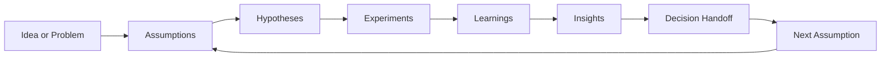

# Learning System Overview

**Purpose**: Explain how SwiftCNS supports evidence-based learning cycles.

## Who this is for

- Teams moving from concept understanding to operational execution.
- Leaders who need to understand artifact continuity across cycles.
- Mentors reviewing whether teams are compounding learning.

## Outcome

Teams understand how work artifacts connect across the full loop.

## SwiftCNS operating loop

In simple terms, the loop works like this:

1. Start with an idea or problem worth understanding.
2. Identify the assumptions that matter most.
3. Form testable hypotheses for selected assumptions.
4. Design and run experiments against those hypotheses.
5. Capture validated learnings from the evidence.
6. Synthesize those learnings into insights.
7. Use insight outputs in team decision routines and begin the next cycle from a stronger place.

This sequence matters because each stage solves a different problem:

- the problem statement defines where uncertainty lives,
- assumptions identify what must be true,
- experiments create evidence,
- learnings clarify what changed,
- insights connect those changes to meaning,
- decisions translate that meaning into action, but this happens as an operating handoff outside the currently persisted product loop.

When teams collapse stages together, they often move quickly at first but lose clarity later.

## What users should expect

- A shared record of assumptions, hypotheses, experiments, learnings, and insights.
- Improved continuity between conversations and execution.
- Faster handoffs between operators, reviewers, and decision makers.

What users should really expect is traceability. A good system makes it easier to see how a decision connects back to the assumption that triggered the cycle in the first place. That traceability is what prevents teams from repeating the same conversations without progressing.

## How the loop works in practice

In practice, this loop is not linear in the sense of being one-and-done. It is iterative. A decision often creates a new assumption, which begins the next cycle.

What matters is not that teams move through the stages perfectly. What matters is that they move through them consciously, with enough clarity to know:

- what they are trying to learn,
- what evidence they actually have,
- what remains uncertain,
- and what action should follow.

## Where teams usually break down

Most breakdowns happen in one of three places:

### 1. Before the experiment

The team has not clearly isolated the assumption or defined a testable hypothesis. When that happens, the experiment may generate activity, but not useful evidence.

### 2. After the experiment

The team has results, but no disciplined way to convert those results into validated learnings. This is where interpretation drift starts.

### 3. At decision time

The team has some learnings, but cannot confidently synthesize them into a clear next move. This is where cycles become long and indecisive.

## How continuity improves learning velocity

Learning velocity is not only about running tests faster. It is also about reducing loss between stages.

Continuity improves when:

- assumptions are visible and traceable,
- hypotheses are explicit before experiment execution,
- experiments remain connected to what they were designed to test,
- learnings are documented in a way others can review,
- insights synthesize meaning instead of restating evidence,
- decision handoff is explicit and owned.

That continuity reduces rework, avoids repeated debates, and lets teams build on prior cycles instead of restarting reasoning from scratch.

## Role lenses

- **Startup**: prioritize speed with evidence discipline.
- **Program manager**: ensure consistency across teams.
- **Mentor**: improve quality of reasoning and decision confidence.

## What good looks like

A healthy team using this system can answer, at any point in time:

- What are we testing?
- What did we learn?
- What changed in our confidence?
- What does that imply?
- What are we doing next?

## Quality gates

- Team can trace any insight back to underlying experiment evidence.
- Team can explain where decision handoff happens and who owns it.
- Team can restart a cycle using prior artifacts as reusable context.

## Definition of done

- Team can explain how each artifact feeds the next.
- Team can identify its current stage and next required output.

## Next step

Continue to [Decision Quality Model](decision-quality-model.md).