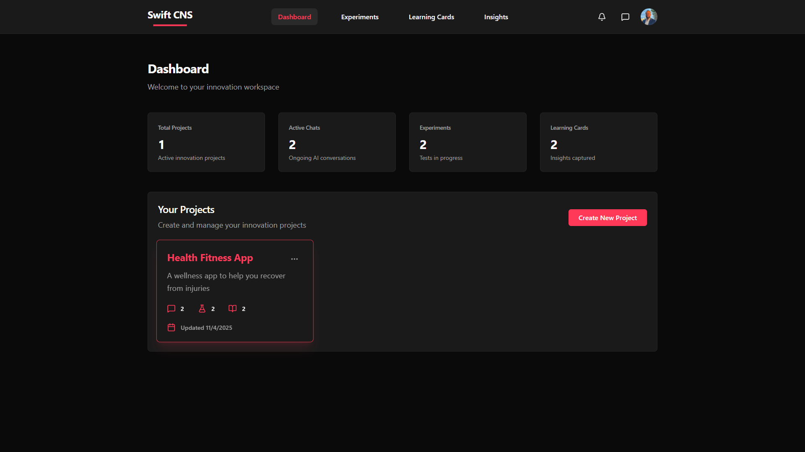
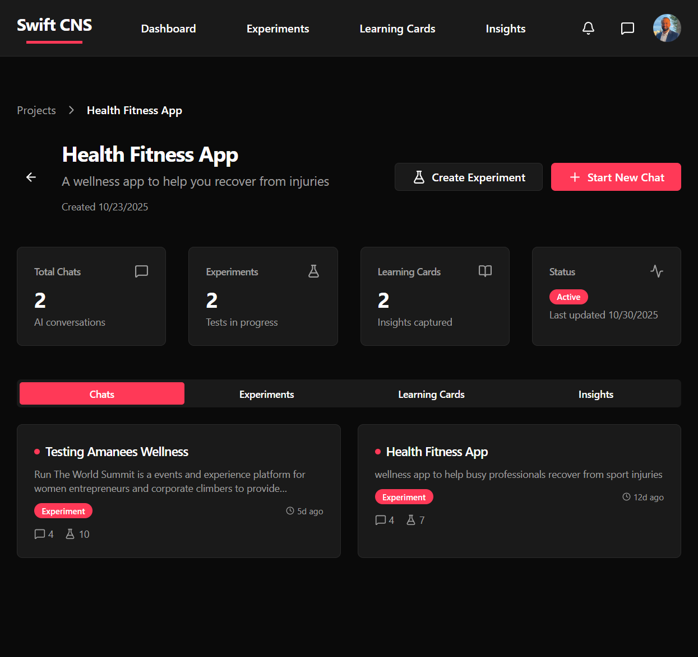

# 01 — Idea / Problem

**Purpose**: Use Swift CNS to articulate your problem and start the validation process

**Outcome**: Have a well-defined problem documented in Swift CNS and ready for AI-guided analysis

**Audience**: PM / Dev / Both

**Time**: 15-30 minutes

**Prerequisites**: [Start Here](start-here/index), [Decide What to Build](index), Swift CNS account at [app.swiftcns.ai](https://app.swiftcns.ai)

## Learning Outcomes

By the end of this chapter, you will be able to:
1. Navigate to Swift CNS and access your project
2. Start a new chat in Swift CNS to analyze your idea
3. Describe your problem clearly in the chat interface
4. Understand how Swift CNS AI will guide you through idea analysis
5. Begin the systematic validation process in Swift CNS

## Jobs-to-Be-Done

- **When**: I have an initial idea or see a potential problem
- **I want**: To use Swift CNS to articulate and validate it systematically
- **So that**: I can get AI-guided analysis and move through the DECIDE process efficiently

## Inputs

- Swift CNS account (sign up at [app.swiftcns.ai](https://app.swiftcns.ai))
- A project created in Swift CNS (or create a new one)
- Initial idea or problem hypothesis
- Basic understanding of what you want to explore

## Activities

### 1. Access Swift CNS

**Navigate to Swift CNS**:
1. Go to [app.swiftcns.ai](https://app.swiftcns.ai)
2. Sign in with your Google account (or existing credentials)
3. You'll land on the Dashboard



> 💡 **Tip**: If you don't have a project yet, you can create one from the Dashboard or start a chat directly.

### 2. Navigate to Your Project

**From the Dashboard**:
1. Click on your project card (e.g., "Health Fitness App")
2. You'll see the project page with tabs: Chats, Experiments, Learning Cards, Insights



**Project Overview**:
- **Total Chats**: Number of AI conversations
- **Experiments**: Number of experiments in progress
- **Learning Cards**: Number of insights captured
- **Status**: Active/Inactive

### 3. Start a New Chat

**To Begin the DECIDE Workflow**:
1. Click the **"Start New Chat"** button on the project page
2. You'll see the "Start a New Chat" form


**What Happens Next** (as shown in the UI):
- **1. Idea Analysis**: AI will analyze your idea and ask clarifying questions
- **2. Assumptions Mapping**: Generate key assumptions that need validation
- **3. Experiment Design**: Create structured experiments to test assumptions
- **4. Learning Cards**: Document insights and learnings from experiments

> 📝 **Note**: Each step builds on the previous one. The AI guides you through the entire DECIDE process.

### 4. Fill Out the Chat Form

**Chat Details**:
1. **Chat Name**: Enter a descriptive name (e.g., "E-commerce Mobile App Ideas")
   - This helps you organize and find your chats later
   
2. **Describe Your Idea**: Provide a detailed description including:
   - What problem does it solve?
   - Who is your target audience?
   - What makes it unique?
   - Any initial thoughts or context

**Example**:
```
Chat Name: Retrospective Tool for Engineering Teams

Describe Your Idea:
Engineering teams struggle to get actionable insights from sprint retrospectives. 
Teams spend 30-60 minutes in retrospectives but often don't identify clear action items. 
This leads to repeating the same issues sprint over sprint.

Target audience: Engineering teams of 5-15 people
Unique value: AI-powered retrospective tool that automatically identifies patterns 
and suggests concrete improvements based on team feedback.
```

> 💡 **Tip**: Be as detailed as possible. The more context you provide, the better the AI can guide you.

### 5. Start the Chat

**After Filling the Form**:
1. Review your chat name and description
2. Click **"Start Chat"** button
3. The AI will begin analyzing your idea and guide you through the DECIDE process

**What the AI Will Do**:
- Analyze your problem statement
- Ask clarifying questions about your idea
- Help you refine your understanding
- Prepare you for the next step: Assumptions Mapping

## Apply It Now

**Task**: Start your first chat in Swift CNS

1. Log in to [app.swiftcns.ai](https://app.swiftcns.ai)
2. Navigate to your project (or create a new one)
3. Click "Start New Chat"
4. Enter a descriptive chat name
5. Describe your idea in detail (problem, target users, unique value)
6. Click "Start Chat" to begin the AI-guided analysis

**Artifact**: A new chat started in Swift CNS with:
- Chat name
- Detailed idea description
- AI analysis ready to begin

## Artifacts

You'll create in Swift CNS:
- A new chat conversation
- Problem description documented
- AI analysis of your idea
- Foundation for the rest of the DECIDE workflow

## Worked Example

**Situation**: Starting a chat for a retrospective tool idea

**Steps in Swift CNS**:
1. **Navigate to Project**: Health Fitness App (or create new project)
2. **Click "Start New Chat"**: Opens the chat creation form
3. **Chat Name**: "Retrospective Tool Validation"
4. **Describe Your Idea**: 
   ```
   Engineering teams struggle to get actionable insights from retrospectives. 
   Teams spend time but don't get clear next steps. 
   I want to build an AI-powered tool that analyzes retrospective feedback 
   and generates actionable insights automatically.
   
   Target users: Engineering teams of 5-15 people
   Problem frequency: Every sprint (2x per month)
   ```
5. **Click "Start Chat"**: AI begins analysis

**What Happens Next**:
- AI analyzes your idea
- Asks clarifying questions
- Helps refine problem statement
- Prepares for Assumptions Mapping

## Checklist

Before proceeding to the next chapter, verify:
- [ ] You've logged into Swift CNS
- [ ] You've navigated to your project
- [ ] You've started a new chat
- [ ] You've entered a descriptive chat name
- [ ] You've described your idea in detail
- [ ] You've clicked "Start Chat" and the AI has begun analysis

## Self-Assessment

1. **Where do you start the DECIDE workflow in Swift CNS?**
   - [ ] Dashboard
   - [ ] Project page → "Start New Chat" ✓
   - [ ] Experiments page

2. **What should you include in your idea description?** (Select all)
   - [ ] Problem statement ✓
   - [ ] Target audience ✓
   - [ ] Unique value ✓
   - [ ] Complete solution design

3. **What does the AI do after you start a chat?**
   - [ ] Immediately creates experiments
   - [ ] Analyzes your idea and asks clarifying questions ✓
   - [ ] Generates assumptions automatically

## Exit Criteria

You're ready to proceed when:
- [ ] You've started a chat in Swift CNS
- [ ] You've described your idea in detail
- [ ] The AI has begun analyzing your idea
- [ ] You're ready for the AI to guide you through Assumptions Mapping

## Dependencies & Next Steps

### Prerequisites Completed
- [Start Here](start-here/index) - Understanding the guide structure
- [Decide What to Build](index) - Understanding the validation process
- Swift CNS account created

### Next Steps
- Continue the chat conversation in Swift CNS
- The AI will guide you through [02 — Identify Critical Assumptions](02-identify-critical-assumptions)
- Follow the AI's prompts and questions

### What This Enables

Starting a chat in Swift CNS enables:
- AI-guided problem analysis
- Systematic validation process
- Structured workflow through DECIDE
- All your work documented in one place

---

> 💡 **Tip**: Be detailed in your initial description. It helps the AI provide better guidance.
> 📝 **Note**: You can always return to your chat and continue the conversation. The AI remembers context.
