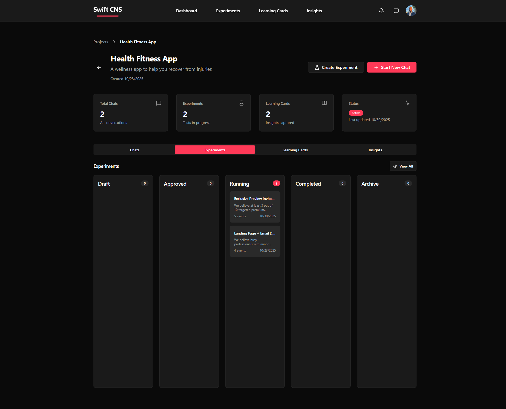

# 04 — Design & Run Experiments

**Purpose**: Use Swift CNS to design and execute experiments to test your hypotheses

**Outcome**: Have experiments designed and running in Swift CNS to validate hypotheses

**Audience**: PM / Dev / Both

**Time**: 1-2 weeks per experiment (ongoing)

**Prerequisites**: [03 — Form Testable Hypotheses](03-form-testable-hypotheses.md) - Hypotheses created in Swift CNS

## Learning Outcomes

By the end of this chapter, you will be able to:

1. Use Swift CNS to design experiments that test specific hypotheses
2. Create experiments manually or from chat conversations
3. Track experiments and their status in Swift CNS
4. Run experiments efficiently with minimal resources
5. Monitor experiment progress in Swift CNS

## Jobs-to-Be-Done

* **When**: I have testable hypotheses ready in Swift CNS
* **I want**: To design and run experiments to test them
* **So that**: I can validate or invalidate assumptions with data

## Inputs

* Testable hypotheses from [03 — Form Testable Hypotheses](03-form-testable-hypotheses.md) in Swift CNS
* Success criteria for each hypothesis
* Access to users or test environment
* Time and resources for experimentation

## Activities

### 1. Design Experiments in Swift CNS

**Two Ways to Create Experiments**:

**Option A: From Chat Conversation** (Recommended)

1. Continue your chat conversation in Swift CNS
2. The AI will guide you through experiment design
3. Follow the AI's prompts to create experiment plans
4. The AI can help you create experiments directly from chat

**Option B: Manual Creation**

1. Navigate to your project in Swift CNS
2. Click **"Create Experiment"** button
3. Fill out the experiment form manually

> 💡 **Tip**: Let the AI guide you first. It helps ensure experiments are well-designed.

### 2. Create Experiment in Swift CNS

**Using the Create Experiment Form**:

1. Click **"Create Experiment"** on your project page
2. Fill out the experiment form:

**Basic Information**:

* **Experiment Name**: Descriptive name (e.g., "Landing Page Interest Test")
* **Theme**: Desirability, Feasibility, Viability (choose one)
* **Hypothesis**: Paste your hypothesis statement
* **Description**: Detailed description of how the experiment will be conducted
* **Experiment Type**: e.g., Landing Page Test, Survey, Concierge Test

**Success Criteria**:

* **Primary Success Criteria**: Main measurable outcome
* **Key Metrics**: Add metrics (name, target, purpose)
  * Example: Conversion Rate, 30%, Measures user interest

**Operational Details**:

* **Setup Complexity** (1-5): How complex is setup?
* **Run Time** (1-5): How long does it take?
* **Cost** (1-5): How expensive is it?
* **Data Reliability** (1-5): How reliable is the data?

**Method Details**:

* **Test Method**: e.g., Survey, Landing Page
* **Sample Size**: e.g., 100 users
* **Duration**: e.g., 2 weeks

**Resources**:

* **Time Required**: e.g., 2 hours per day
* **Budget**: e.g., $500
* **Tools**: e.g., Google Forms, Typeform
* **Team Members**: e.g., Product Manager, Designer

**Risks & Mitigation**:

* **Risk**: Describe the risk
* **Mitigation**: How to mitigate this risk

### 3. Set Up and Run Experiments

**After Creating Experiment**:

1. Review your experiment plan in Swift CNS
2. Set up the experiment (create landing page, survey, etc.)
3. Launch the experiment
4. Drive traffic (if needed)
5. Collect data

**In Swift CNS**:

* Experiments are tracked on the Experiments tab
* You can see status: Draft, Approved, Running, Completed, Archive
* Monitor progress and results

### 4. Track Experiments in Swift CNS

**View All Experiments**:

1. Navigate to **Experiments** tab in your project
2. Or go to global **Experiments** page (from main nav)

**Experiment Status**:

* **Draft**: Not yet started
* **Approved**: Ready to run
* **Running**: Currently in progress
* **Completed**: Finished, results analyzed
* **Archive**: Archived for reference

### 5. Monitor Experiment Progress

**In Swift CNS**:

* View experiment details
* Track metrics and results
* Update status as you progress
* Document observations

**Key Metrics to Track**:

* Conversion rates
* Signup rates
* Usage metrics
* Time spent
* Completion rates

## Apply It Now

**Task**: Design and create your first experiment in Swift CNS

1. Continue your chat conversation OR click "Create Experiment"
2. Design your experiment (use AI guidance or manual form)
3. Fill out all experiment details (hypothesis, success criteria, method, resources)
4. Create the experiment in Swift CNS
5. Set up the experiment (create landing page, survey, etc.)
6. Launch and run the experiment
7. Track progress in Swift CNS

**Artifact**: An experiment in Swift CNS with:

* Experiment design
* Success criteria
* Method details
* Resources identified
* Status: Running

## Artifacts

You'll create in Swift CNS:

* Experiment plans
* Experiment records
* Status tracking
* Results documentation

## Worked Example

**Situation**: Creating experiment for retrospective tool in Swift CNS

**Steps in Swift CNS**:

1. **Click "Create Experiment"** on project page
2. **Fill Out Form**:
   * Experiment Name: "Landing Page Interest Test"
   * Theme: Desirability
   * Hypothesis: "We believe teams will use an AI-powered retrospective tool. If we create a landing page with mockups, then at least 30% of visitors will sign up for early access. We'll know this is true when we see 30%+ conversion rate after 100 visitors."
   * Experiment Type: Landing Page Test
   * Test Method: Landing page with mockups
   * Sample Size: 100 visitors
   * Duration: 1 week
   * Primary Success Criteria: 30% conversion rate
   * Key Metrics: Conversion Rate, 30%, Measures user interest
3. **Click "Create Experiment"**
4. **Set Up Experiment**: Create landing page, add tracking
5. **Launch**: Drive traffic, collect data
6. **Track in Swift CNS**: Monitor results, update status

**Result in Swift CNS**:

* Experiment created and visible in Experiments tab
* Status: Running
* Metrics tracked
* Results documented

## Checklist

Before proceeding to the next chapter, verify:

* [ ] Experiment is designed in Swift CNS
* [ ] Experiment form is completed (hypothesis, success criteria, method, resources)
* [ ] Experiment is created in Swift CNS
* [ ] Experiment is set up and running
* [ ] Data collection is in place
* [ ] Results are being tracked in Swift CNS

## Self-Assessment

1. **How can you create experiments in Swift CNS?** (Select all)
   * [ ] From chat conversation with AI ✓
   * [ ] Manually using "Create Experiment" ✓
   * [ ] Only from chat
2. **What should you include in experiment design?** (Select all)
   * [ ] Hypothesis ✓
   * [ ] Success criteria ✓
   * [ ] Method details ✓
   * [ ] Resources ✓
3. **What can you track in Swift CNS?** (Select all)
   * [ ] Experiment status ✓
   * [ ] Metrics and results ✓
   * [ ] Progress ✓
   * [ ] All of the above ✓

## Exit Criteria

You're ready to proceed when:

* [ ] At least one experiment is created in Swift CNS
* [ ] Experiment is running and collecting data
* [ ] You have reliable data (met sample size)
* [ ] You're ready to analyze learnings

## Dependencies & Next Steps

### Prerequisites Completed

* [03 — Form Testable Hypotheses](03-form-testable-hypotheses.md) - Testable hypotheses in Swift CNS

### Next Steps

* Continue running experiments and collecting data
* Proceed to [05 — Extract Key Learnings](05-extract-key-learnings.md) to analyze results in Swift CNS
* Use Swift CNS Learning Cards to document learnings

### What This Enables

Running experiments in Swift CNS enables:

* Data-driven validation
* Tracked progress and results
* Systematic learning
* Clear go/no-go decisions

***

> 💡 **Tip**: Use the AI guidance first. It helps ensure experiments are well-designed. 📝 **Note**: You can create multiple experiments. Start with the highest priority hypothesis.
