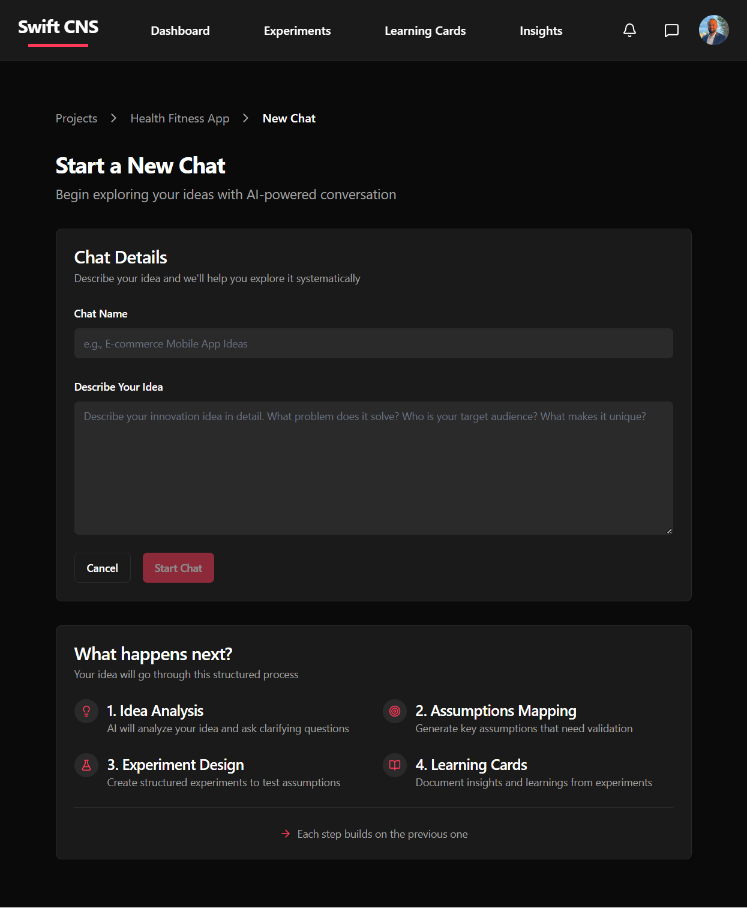

# 05 — Extract Key Learnings

> **Purpose**: Use Swift CNS Learning Cards to analyze experiment results and extract insights
> **Outcome**: Have clear learnings documented in Swift CNS Learning Cards that inform decisions
> **Audience**: PM / Dev / Both
> **Time**: 1-2 hours per experiment
> **Prerequisites**: [04 — Design & Run Experiments](04-design-run-experiments.md) - Experiments completed in Swift CNS

## Learning Outcomes

By the end of this chapter, you will be able to:
1. Use Swift CNS Learning Cards to document experiment results
2. Analyze quantitative and qualitative data from experiments
3. Create Learning Cards in Swift CNS
4. Extract actionable insights from results
5. Document learnings for decision-making in Swift CNS

## Jobs-to-Be-Done

- **When**: I have completed experiments and collected data in Swift CNS
- **I want**: To analyze results and extract insights using Learning Cards
- **So that**: I can make informed decisions about what to build

## Inputs

- Completed experiments in Swift CNS from [04 — Design & Run Experiments](04-design-run-experiments.md)
- Experiment results and data (quantitative and qualitative)
- Success criteria for each hypothesis
- Experiment notes and observations

## Activities

### 1. Access Learning Cards in Swift CNS

**Navigate to Learning Cards**:
1. Go to your project in Swift CNS
2. Click the **"Learning Cards"** tab
3. Or go to global **Learning Cards** page (from main nav)



**What You'll See**:
- List of existing Learning Cards
- Cards showing experiment results and insights
- Status: validated, invalidated, or inconclusive
- Tags and categories

### 2. Create Learning Cards

**Two Ways to Create Learning Cards**:

**Option A: From Chat Conversation** (Recommended)
1. Continue your chat conversation in Swift CNS
2. After experiment results are available, the AI will guide you
3. The AI can help create Learning Cards from experiment results

**Option B: Manual Creation**
1. Navigate to **Learning Cards** tab or page
2. Click **"Create Learning Card"** button
3. Fill out the Learning Card form


### 3. Analyze Experiment Results

**For Each Experiment**:

**Analyze Quantitative Data**:
- Compare results to success criteria
- Did the metric meet the threshold?
- Was the sample size sufficient?
- Are there any anomalies?

**Analyze Qualitative Data**:
- Review user feedback
- Identify patterns in responses
- Note surprises or concerns
- Document observations

**Example Analysis**:
```
Hypothesis: 30% conversion rate
Result: 23.3% conversion rate
Sample: 120 visitors
Conclusion: Hypothesis invalidated (below threshold)

Qualitative Insights:
- Users: "Looks interesting but not sure I'd use it regularly"
- Pattern: Interest exists but commitment is low
```

### 4. Document Learnings in Learning Cards

**Learning Card Structure**:
- **Title**: Summary of the learning
- **Summary**: Detailed description of results
- **Status**: Validated, Invalidated, or Inconclusive
- **Key Insights**: Main takeaways
- **Tags**: Categorization (e.g., user-interest, value-proposition)
- **Observations**: Number of observations/data points
- **Insights**: Number of insights extracted

**Example Learning Card**:
```
Title: Landing Page Interest Test - Below Target
Summary: Landing page test showed 23.3% conversion rate, below 30% target. 
120 visitors, 28 signups. Interest exists but commitment is low.
Status: Invalidated
Key Insights: Value proposition needs refinement before building
Tags: user-interest, value-proposition, landing-page
Observations: 120
Insights: 3
```

### 5. Extract Key Insights

**For Each Learning Card**:
1. **Identify Patterns**: What patterns emerge from the data?
2. **Determine Hypothesis Status**: Validated, Invalidated, or Inconclusive?
3. **Extract Learnings**: What did you learn?
4. **Document Implications**: How does this affect your decision?

**Example Insights**:
```
Learning: Users are interested but not committed
Evidence: 23% conversion rate (below 30% threshold), qualitative feedback shows hesitation
Impact: Value proposition needs refinement before building
Action: Refine value proposition, test again, or pivot
```

### 6. Review Learning Cards

**In Swift CNS**:
- View all Learning Cards in your project
- Filter by status (validated, invalidated, inconclusive)
- Filter by tags
- Search by title or summary

**Review Process**:
1. Review each Learning Card
2. Verify insights are accurate
3. Confirm implications are clear
4. Ensure status is correct

## Apply It Now

**Task**: Create Learning Cards for your experiment results in Swift CNS

1. Navigate to Learning Cards in Swift CNS
2. Click "Create Learning Card" (or use AI guidance)
3. Analyze experiment results (quantitative and qualitative)
4. Document learnings in the Learning Card
5. Extract key insights and implications
6. Set status (validated/invalidated/inconclusive)
7. Add tags and categorize

**Artifact**: Learning Cards in Swift CNS with:
- Experiment results analyzed
- Learnings extracted
- Insights documented
- Status determined
- Implications clear

## Artifacts

You'll create in Swift CNS:
- Learning Cards with results
- Insights extracted
- Hypothesis status determined
- Implications documented

## Worked Example

**Situation**: Creating Learning Card for retrospective tool experiment in Swift CNS

**Steps in Swift CNS**:
1. **Navigate to Learning Cards** tab in project
2. **Click "Create Learning Card"**
3. **Fill Out Form**:
   - Title: "Landing Page Interest Test - Below Target"
   - Summary: "Landing page test showed 23.3% conversion rate, below 30% target. 120 visitors, 28 signups. Interest exists but commitment is low."
   - Status: Invalidated
   - Key Insights: "Value proposition needs refinement before building. Users are interested but not committed."
   - Tags: user-interest, value-proposition, landing-page
4. **Save Learning Card**
5. **Review in Learning Cards** tab

**Result in Swift CNS**:
- Learning Card created and visible
- Status: Invalidated
- Insights documented
- Ready for synthesis

## Checklist

Before proceeding to the next chapter, verify:
- [ ] Experiment results are analyzed
- [ ] Learning Cards are created in Swift CNS
- [ ] Learnings are documented
- [ ] Insights are extracted
- [ ] Hypothesis status is determined (validated/invalidated/inconclusive)
- [ ] Implications are clear

## Self-Assessment

1. **Where do you create Learning Cards in Swift CNS?** (Select all)
   - [ ] Learning Cards tab in project ✓
   - [ ] Learning Cards page (global) ✓
   - [ ] From chat conversation ✓
   - [ ] Only from experiments

2. **What should you analyze?** (Select all)
   - [ ] Quantitative data ✓
   - [ ] Qualitative feedback ✓
   - [ ] Patterns ✓
   - [ ] Only positive results

3. **What should you document in Learning Cards?** (Select all)
   - [ ] Results ✓
   - [ ] Insights ✓
   - [ ] Status ✓
   - [ ] Implications ✓

## Exit Criteria

You're ready to proceed when:
- [ ] Experiment results are analyzed
- [ ] Learning Cards are created in Swift CNS
- [ ] Learnings are documented
- [ ] Insights are extracted
- [ ] You're ready to synthesize insights into a decision

## Dependencies & Next Steps

### Prerequisites Completed
- [04 — Design & Run Experiments](04-design-run-experiments.md) - Experiment results in Swift CNS

### Next Steps
- Proceed to [06 — Synthesize Insights → Decision](06-synthesize-insights-decision.md) to make a go/no-go decision
- Use Swift CNS Insights to view aggregated learnings

### What This Enables

Learning Cards in Swift CNS enable:
- Documented learnings
- Clear hypothesis status
- Actionable insights
- Informed decisions

---

> 💡 **Tip**: Create Learning Cards as soon as you have results. Don't wait for perfect analysis.
> 📝 **Note**: Invalidated hypotheses are valuable. They tell you what not to build.
