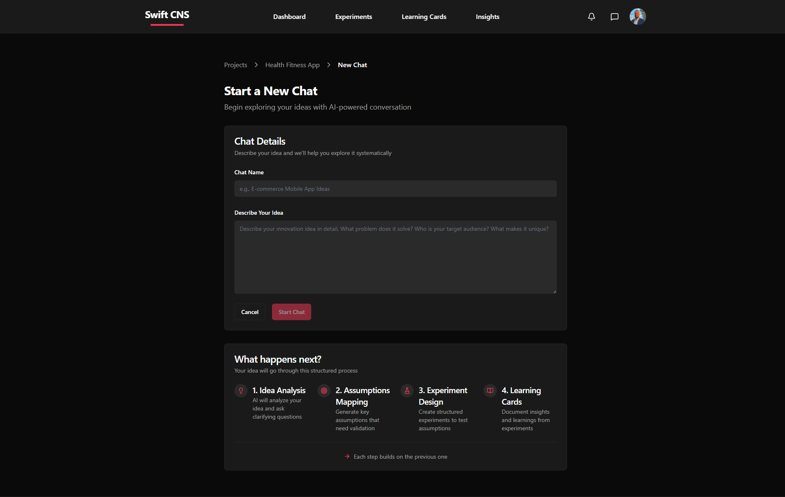

# Decide What to Build

**Purpose**: Use Swift CNS to validate ideas before building

**Outcome**: Make data-driven decisions about what to build based on validated assumptions

**Audience**: PM / Dev / Both

**Time**: 2-4 weeks (depending on complexity)

**Prerequisites**: [Start Here](start-here/index.md), Swift CNS account at [app.swiftcns.ai](https://app.swiftcns.ai)

## Learning Outcomes

By the end of this section, you will be able to:

1. Use Swift CNS to articulate clear problem statements and value propositions
2. Use Swift CNS AI to identify critical assumptions that must be true for success
3. Use Swift CNS to formulate testable hypotheses with measurable outcomes
4. Use Swift CNS to design and run experiments to validate assumptions
5. Use Swift CNS Learning Cards and Insights to synthesize learnings into go/no-go decisions

## Jobs-to-Be-Done

* **When**: I have an idea for a product or feature
* **I want**: To use Swift CNS to validate it before building
* **So that**: I can avoid wasting time on products that won't succeed

## Inputs

* Swift CNS account (sign up at [app.swiftcns.ai](https://app.swiftcns.ai))
* Initial idea or problem hypothesis
* Access to potential users or customers
* Time for experimentation (2-4 weeks recommended)

## Activities

This section follows a systematic validation process using Swift CNS:

1. [**01 — Idea / Problem**](01-idea-problem.md): Use Swift CNS chat to articulate the problem and value proposition
2. [**02 — Identify Critical Assumptions**](02-identify-critical-assumptions.md): Use Swift CNS AI to find what must be true for success
3. [**03 — Form Testable Hypotheses**](03-form-testable-hypotheses.md): Use Swift CNS AI to create testable statements
4. [**04 — Design & Run Experiments**](04-design-run-experiments.md): Use Swift CNS to test your hypotheses
5. [**05 — Extract Key Learnings**](05-extract-key-learnings.md): Use Swift CNS Learning Cards to analyze results
6. [**06 — Synthesize Insights → Decision**](06-synthesize-insights-decision.md): Use Swift CNS Insights to make a go/no-go decision

> 💡 **Tip**: These chapters must be done sequentially. Each builds on the previous one. Swift CNS AI guides you through the entire process.

## Swift CNS Workflow Overview

**The DECIDE Workflow in Swift CNS**:

1. **Start New Chat**: Begin AI-guided conversation about your idea
2. **Idea Analysis**: AI analyzes your idea and asks clarifying questions
3. **Assumptions Mapping**: AI helps identify critical assumptions
4. **Experiment Design**: AI guides you to create structured experiments
5. **Learning Cards**: Document insights and learnings from experiments
6. **Insights**: View aggregated insights to make decisions

## Apply It Now

**Task**: Assess your readiness to use Swift CNS for validation

1. Do you have a Swift CNS account?
   * [ ] Yes → Ready to proceed
   * [ ] No → Sign up at [app.swiftcns.ai](https://app.swiftcns.ai)
2. Do you have a project in Swift CNS?
   * [ ] Yes → Ready for [01 — Idea / Problem](01-idea-problem.md)
   * [ ] No → Create a new project first
3. Do you have access to potential users for experiments?
   * [ ] Yes → Ready to proceed
   * [ ] No → Identify how to reach potential users
4. Do you have time allocated for experimentation (2-4 weeks)?
   * [ ] Yes → Ready to proceed
   * [ ] No → Plan time allocation using [Cadence](start-here/cadence.md)

**Artifact**: A readiness assessment showing what you need before starting

## Artifacts

You'll create throughout this section in Swift CNS:

* Chat conversations with AI guidance
* Problem statement and value proposition
* Critical assumptions list
* Testable hypotheses
* Experiment plans
* Learning Cards with results
* Insights and decision document

## Worked Example

**Situation**: Validating a product idea for improving team retrospectives using Swift CNS

**Swift CNS Process**:

1. **Start New Chat**: "Retrospective Tool Validation"
2. **Idea Analysis**: Describe problem, AI asks clarifying questions
3. **Assumptions Mapping**: AI identifies critical assumptions
4. **Hypothesis Formation**: AI helps convert assumptions to hypotheses
5. **Experiment Design**: Create experiment in Swift CNS
6. **Run Experiment**: Landing page test, collect data
7. **Learning Card**: Document results, extract insights
8. **Insights**: View aggregated learnings, make decision

**Result**: Decision to pivot - refine value proposition before building

## Checklist

Before starting this section, verify:

* [ ] You have a Swift CNS account
* [ ] You have a project created in Swift CNS
* [ ] You understand the Swift CNS workflow
* [ ] You have access to potential users
* [ ] You have time allocated for experimentation
* [ ] You're ready to follow the chapters sequentially

## Self-Assessment

1. **What is the first step in the Decide section with Swift CNS?**
   * [ ] Create experiment
   * [ ] Start New Chat ✓
   * [ ] Create Learning Card
2. **How long should you allocate for the Decide section?**
   * [ ] 1 week
   * [ ] 2-4 weeks ✓
   * [ ] 6-8 weeks
3. **Can chapters in the Decide section be done in parallel?**
   * [ ] Yes
   * [ ] No ✓ (They must be done sequentially)

## Exit Criteria

You're ready to proceed to "Build the MVP" when:

* [ ] You've completed all Decide chapters (01-06) in Swift CNS
* [ ] You have a validated hypothesis or decision to build
* [ ] You've documented your go/no-go decision in Swift CNS
* [ ] You understand why you're building (or pivoting)

## Dependencies & Next Steps

### Prerequisites Completed

* [Start Here](start-here/index.md) - Understanding the guide structure
* Swift CNS account created

### Next Steps

* Start with [01 — Idea / Problem](01-idea-problem.md) to start a chat in Swift CNS
* Follow chapters sequentially through [06 — Synthesize Insights → Decision](06-synthesize-insights-decision.md)

### What This Enables

Completing this section with Swift CNS enables:

* Data-driven decisions about what to build
* Reduced waste from building wrong products
* Clear understanding of user needs
* Validated value propositions
* All your work documented in Swift CNS

### Related Sections

* [Build the MVP](../build/index.md) - If decision is to build
* [Start Here](start-here/index.md) - If you need to pivot or restart

***

> ⚠️ **Warning**: Don't skip chapters in this section. Each builds on the previous one. Swift CNS AI guides you through the entire process. 💡 **Tip**: Allocate 2-4 weeks for thorough validation before building. Use Swift CNS to track everything systematically.
