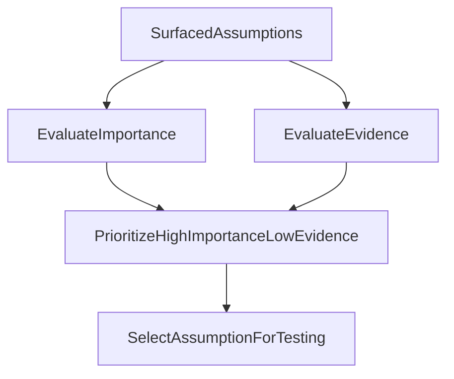

# 02 - Identify Critical Assumptions

**Purpose**: Convert broad uncertainty into a prioritized set of assumptions worth testing first.

## Who this is for

- Teams narrowing uncertainty before hypothesis design.
- Reviewers validating assumption selection quality.

## Outcome

You select one or more high-importance, low-evidence assumptions to validate.

## Why this stage matters

This stage decides where your cycle spends attention. If the wrong assumption is selected, even a perfectly run experiment may produce evidence that does not materially improve decisions.

## Inputs

- A kickoff conversation with sufficient context.
- Clarifying-question responses in the thread.

## Steps in SwiftCNS

### 1) Review surfaced assumptions from Assumption Discovery

Reference screenshot: `../screenshots/05-select-assumptions.png`

- Wait for the agent to map assumptions from your problem context.
- Inspect each assumption's **importance** and **evidence** profile.
- Focus on assumptions with high downside risk if wrong.

### 2) Prioritize based on risk and evidence gap

- Favor assumptions that are both:
  - high importance to initiative success, and
  - currently weak on supporting evidence.
- Do not optimize for "easy to test" only.

### 3) Select assumptions to move forward

- Select one primary assumption (or a small set if tightly related).
- Keep initial scope narrow so your first cycle produces a clear signal.

## Selection logic

## Quality gates

- Selected assumption is explicit and independently testable.
- Team can state why this assumption is risky if false.
- Evidence gap is visible and agreed.

## Common mistakes

- Picking assumptions that are interesting but not consequential.
- Selecting too many assumptions in the first cycle.
- Confusing confidence in the idea with evidence quality.

## Outputs

- One prioritized assumption selection in the conversation.
- Clear handoff context for hypothesis generation.

## Definition of done

- Team can answer: "Why this assumption first, and what would we learn if it is false?"

## Next step

Continue to [03 - Form Testable Hypotheses](03-form-testable-hypotheses.md).
