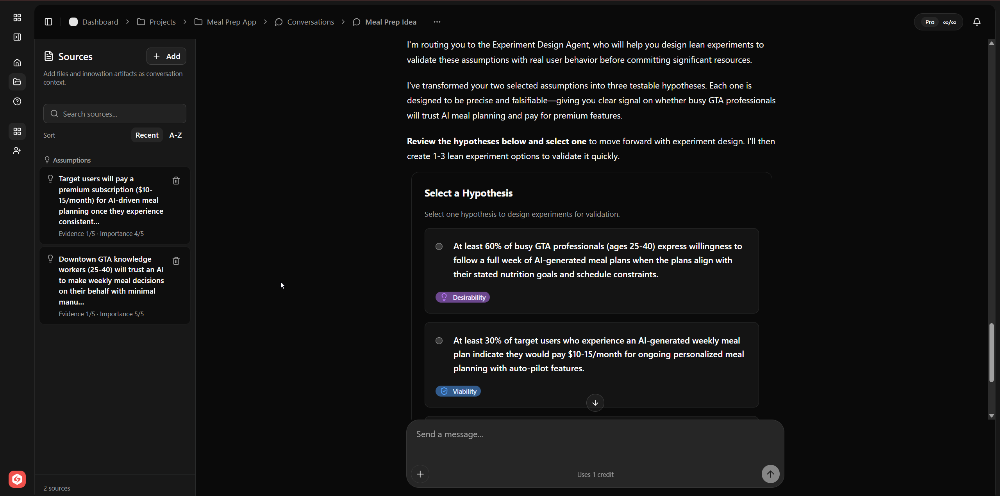

# 03 - Form Testable Hypotheses

**Purpose**: Translate selected assumptions into testable predictions that can drive experiment design.

## Who this is for

- Teams ready to turn assumption risk into measurable tests.
- Mentors and reviewers checking falsifiability and signal clarity.

## Outcome

You choose a hypothesis with explicit validation and invalidation signals.

## Why this stage matters

Hypotheses are where reasoning quality becomes operational quality. A precise hypothesis produces focused experiments and interpretable evidence. A vague hypothesis produces activity and debate.

## Inputs

- At least one selected critical assumption.
- Conversation context with problem framing and clarifications.

## Steps in SwiftCNS

### 1) Review proposed hypotheses

Screenshot:

- The Experiment Design workflow proposes multiple candidate hypotheses.
- Compare each option for precision, testability, and relevance to the selected assumption.

### 2) Inspect hypothesis type

- Use the type tag (desirability, feasibility, viability) to ensure the test matches your uncertainty.
- Avoid mixing multiple uncertainty types in one first hypothesis.

### 3) Select the best hypothesis to test now

- Pick the hypothesis with the clearest measurable signal and shortest meaningful test path.
- Ensure it has usable success and failure conditions.

## Quality gates

- Hypothesis is falsifiable.
- Success and invalidation conditions are explicit.
- Team agrees what data would change confidence.

## Common mistakes

- Choosing a hypothesis that cannot be disproven in practice.
- Mixing desirability, feasibility, and viability in one initial test.
- Defining success criteria after the experiment is already running.

## Outputs

- One selected hypothesis tied to the chosen assumption.
- Ready state for experiment option generation.

## Definition of done

- Team can state: "If we see X signal, confidence increases; if we see Y, confidence drops."

## Next step

Continue to [04 - Design and Run Experiments](04-design-run-experiments.md).
