# 04 - Design and Run Experiments

**Purpose**: Select the right experiment, coordinate execution in EMS, and capture reliable activity data.

## Who this is for

- Operators responsible for turning hypotheses into executed tests.
- Experiment owners coordinating scope, timing, and evidence capture.

## Outcome

You move from hypothesis to an approved, executed experiment with locked tracker data ready for learning generation.

## Why this stage matters

This is the highest-risk operational stage. Teams can lose weeks here through weak ownership, unclear success criteria, or poor tracker design. EMS exists to prevent that drift by making experiment state, ownership, and evidence capture explicit.

## Inputs

- Selected hypothesis.
- Team constraints (owner capacity, budget, and timeline).

## Steps in SwiftCNS

### 1) Compare experiment options in conversation

Screenshots:

- Review proposed experiment cards and their tradeoffs.
- Check type, test description, success criteria, and key metrics.
- Balance reliability vs setup complexity, runtime, and cost.

### 2) Select an experiment and open it in EMS

- Click the selected experiment card in chat.
- Confirm routing into the Experiment Management System.

### 3) Refine draft experiment details

Screenshots:

- In draft mode, update type, description, success criteria, and key metrics as needed.
- Assign an owner and due date for execution accountability.

### 4) Approve and lock experiment for execution

Screenshot:

- Confirm team alignment.
- Approve the experiment so execution is constrained to an agreed test plan.

### 5) Set up and populate the data tracker

Screenshots:

- Open **Data Tracker** from experiment details.
- Build columns manually or use Data Tracking Agent assistance.
- Capture activity rows during experiment execution.
- Import CSV data when relevant.
- Lock tracker when evidence capture is complete.

### 6) Mark experiment complete and prepare learning generation

- Return to experiment details.
- Confirm completion state and proceed to learning generation.

## Coordination model

```mermaid
flowchart LR
  experimentSelection[ExperimentSelectionInChat] --> draftExperiment[DraftExperimentInEMS]
  draftExperiment --> assignOwner[AssignOwnerAndDueDate]
  assignOwner --> approvalGate[ApprovalGate]
  approvalGate --> execution[ExecutionWindow]
  execution --> dataTrackerCapture[DataTrackerCapture]
  dataTrackerCapture --> trackerLock[TrackerLock]
  trackerLock --> readyForLearning[ReadyForLearningGeneration]
```

## Quality gates

- Experiment criteria are specific and measurable.
- Owner and due date are assigned.
- Tracker schema captures data needed for learning synthesis.
- Tracker data is complete and locked before learning generation.

## Common mistakes

- Approving experiment scope before criteria are clear.
- Running tests without assigning explicit owner and due date.
- Capturing tracker rows that cannot support the chosen metrics.
- Locking tracker too early or too late relative to execution quality.

## Outputs

- Approved experiment in EMS.
- Captured and locked execution data.
- Completed experiment ready for learning-card generation.

## Definition of done

- Team can trace experiment execution from hypothesis to locked dataset with no missing ownership or criteria.

## Next step

Continue to [05 - Extract Key Learnings and Insights](05-extract-key-learnings.md).
