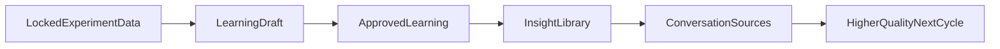

# 05 - Extract Key Learnings and Insights

**Purpose**: Turn experiment evidence into an approved learning card, then compound knowledge through the insights library and conversation Sources.

## Who this is for

- Teams synthesizing experiment evidence into reusable learning.
- Decision stakeholders reviewing confidence and implications.

## Outcome

You produce reusable learning and insight artifacts that improve the next cycle's quality.

## Why this stage matters

This is where many teams accidentally break compounding. If learning drafts are treated as final truth, or insights are not reused through Sources, each new cycle starts from memory loss instead of evidence continuity.

## Inputs

- Completed experiment.
- Locked tracker data.
- Optional additional context from team notes and related artifacts.

## Steps in SwiftCNS

### 1) Generate a learning card from experiment data

Reference screenshots:

- `../screenshots/08.6-generate-learning-card-ems.png`
- `../screenshots/08.7-generate-learning-card-submit-ems.png`

- Open **Generate learning card** from experiment details.
- Provide additional context where helpful; tracker data is included.
- Submit and wait for synthesis processing.

### 2) Review learning card draft

Reference screenshot: `../screenshots/09-learning-card-draft-ems.png`

- Review generated observations, insights, and recommended actions.
- Edit for factual accuracy and clarity.
- Add summary, notes, and tags as needed.
- Approve when quality is sufficient.

### 3) Use insights library as shared team memory

Reference screenshot: `../screenshots/09.1-insights-library-ems.png`

- Review insight artifacts across experiments.
- Use these records to align product, strategy, and operations discussions.

### 4) Compound future runs through conversation Sources

Reference screenshot: `../screenshots/09.2-conversation-sources.png`

- In new conversations, open the Sources panel.
- Attach relevant artifacts (documents, assumptions, hypotheses, experiments, learnings, insights).
- Use prior artifacts as context to design stronger next experiments.

## Compounding loop

## Quality gates

- Learning draft clearly separates evidence from interpretation.
- Recommended actions are concrete and test-relevant.
- Insight entries are reusable and discoverable by tags/context.
- Sources are intentionally selected for next-cycle relevance.

## Common mistakes

- Approving learning draft without checking evidence interpretation.
- Writing recommendations that are inspirational but non-actionable.
- Treating insight library as archive instead of active decision input.
- Starting new conversations without adding prior cycle sources.

## Outputs

- Approved learning card.
- Insight records in library.
- Reusable context attached in conversation Sources.

## Definition of done

- Team can show how one completed experiment improved the next cycle's starting context.

## Decision handoff note

SwiftCNS persists artifacts through insight. Teams make downstream operating decisions (go, iterate, pivot, stop) using these artifacts in their own decision routines.

## Next step

Return to [02 - Identify Critical Assumptions](02-identify-critical-assumptions.md) and run the next cycle with stronger context.
