# Run Learning Cycles in SwiftCNS

**Purpose**: Show exactly how operators use SwiftCNS from project kickoff through insight generation.

## Who this is for

- Teams running live innovation cycles in product.
- Program managers ensuring consistent execution quality.
- Mentors reviewing artifact quality at critical checkpoints.

## Outcome

By the end of this section, a team can run the shipped loop repeatedly in product:

**idea/problem -> assumption -> hypothesis -> experiment -> learning -> insight**

SwiftCNS currently persists artifacts through **Insight**. Teams then make downstream decisions (go, iterate, pivot, stop) in their operating process.

## Why this section matters

This is where strategy becomes behavior. Earlier pages establish terms and quality bars. These pages show exactly how those standards appear in the real product experience: from conversation context, to assumption selection, to hypothesis and experiment design, through EMS execution and learning synthesis.

If your team wants to improve learning velocity without sacrificing evidence quality, this is the core operating path.

## Evidence source for this guide

This workflow is based on current UI walkthrough evidence in `screenshots/`:

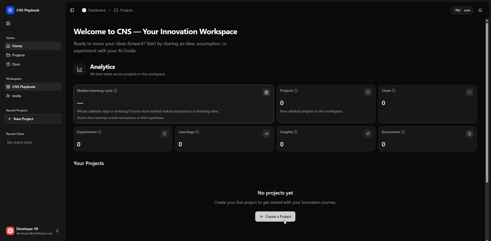
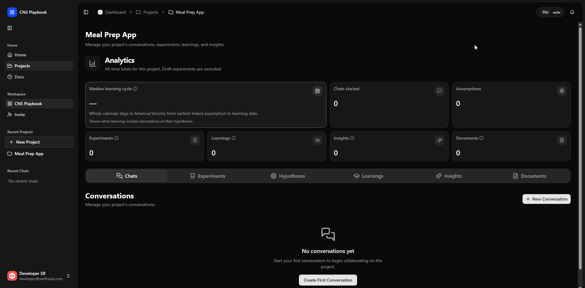
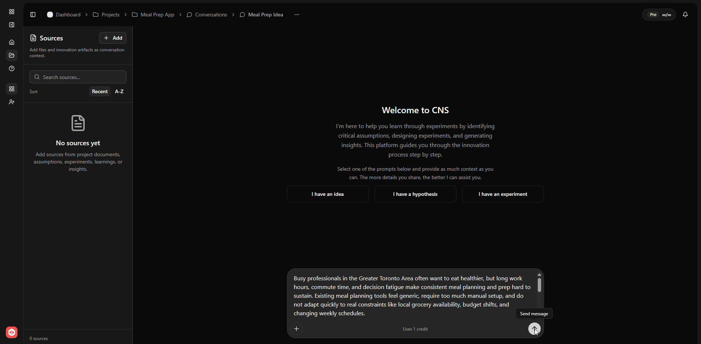
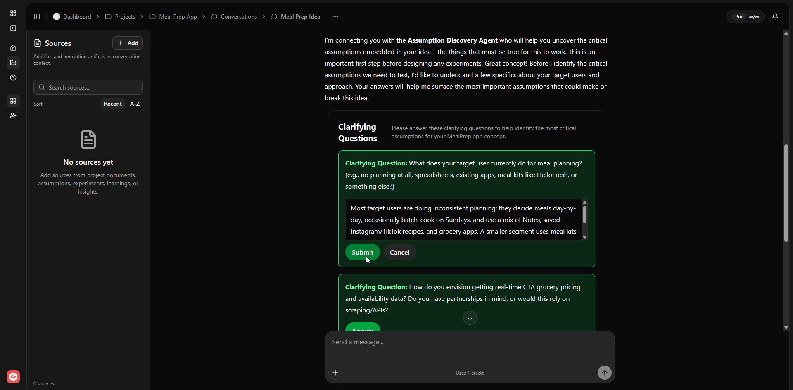
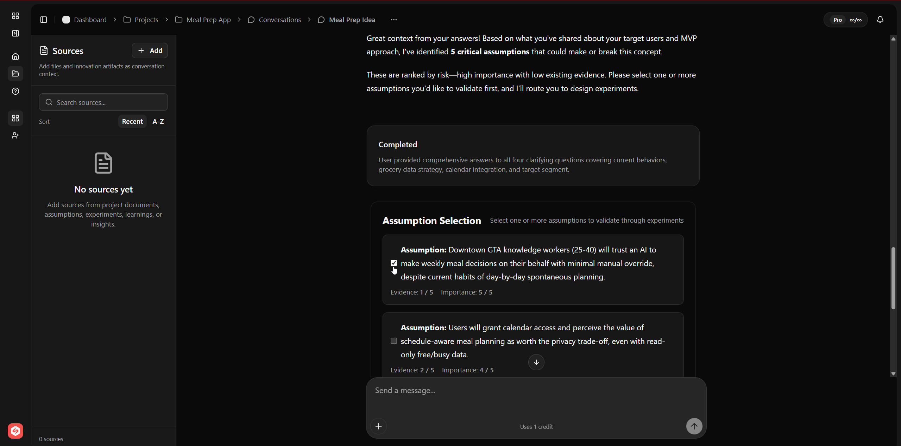

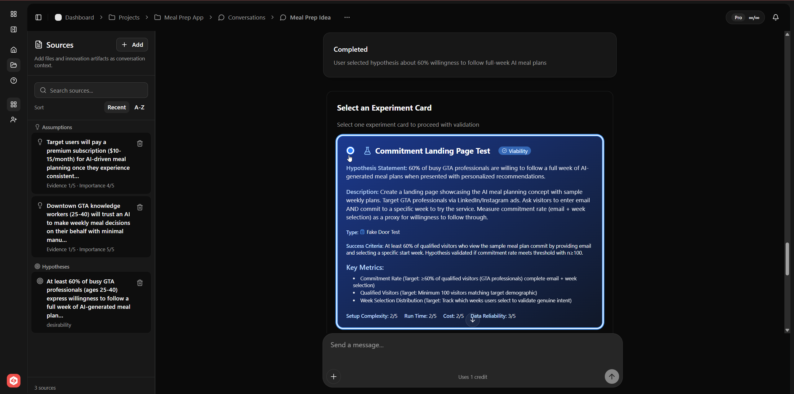
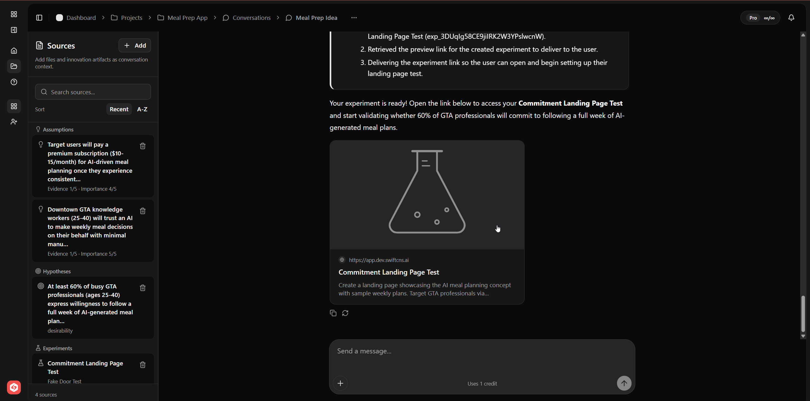
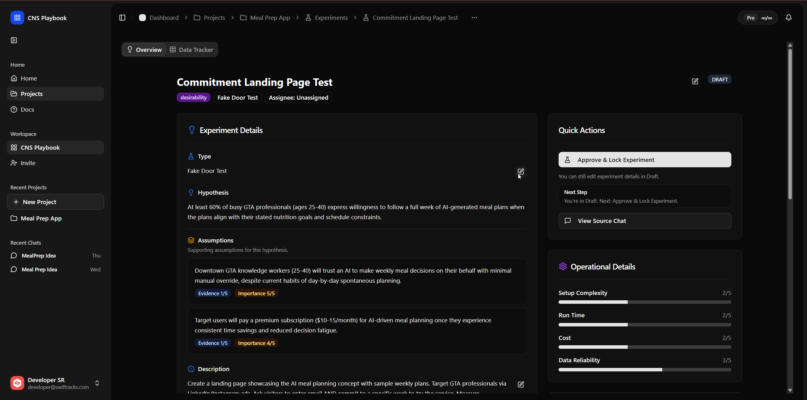
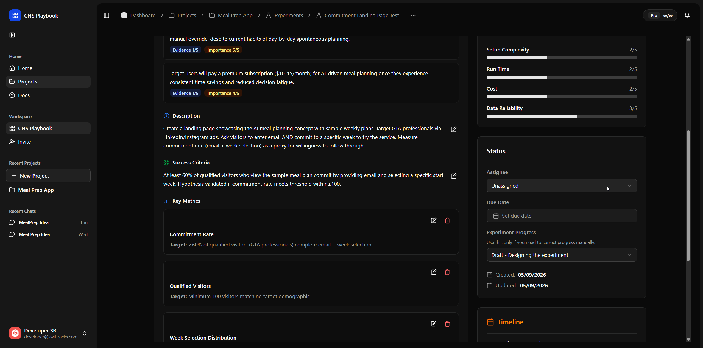
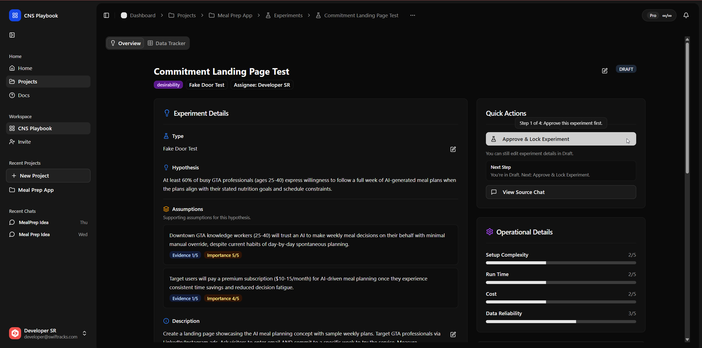
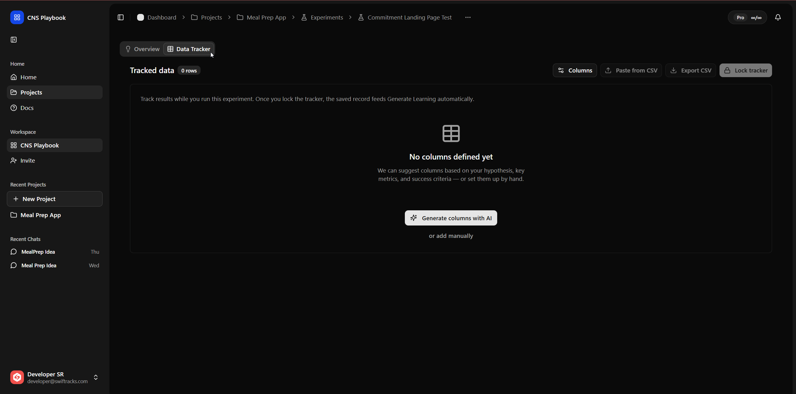
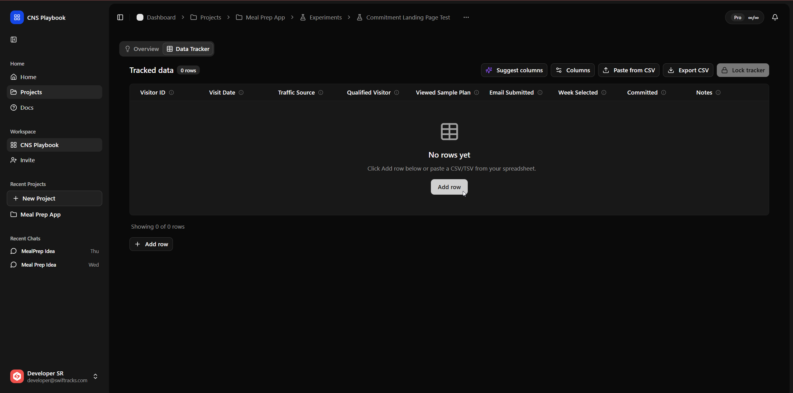
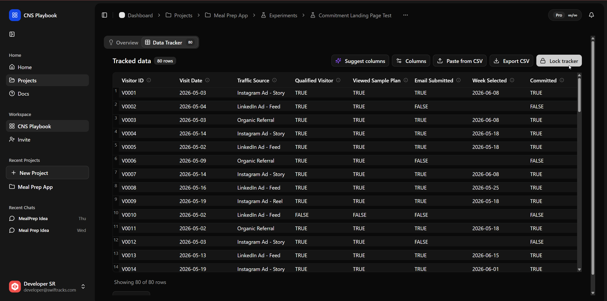
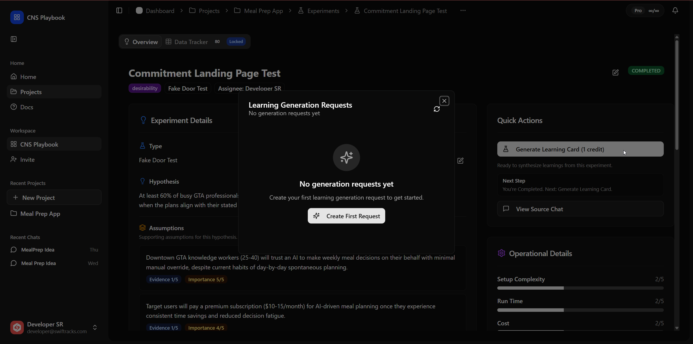
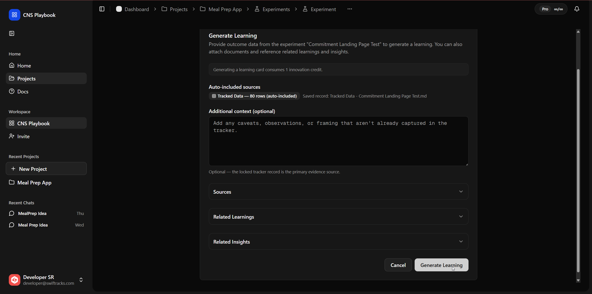
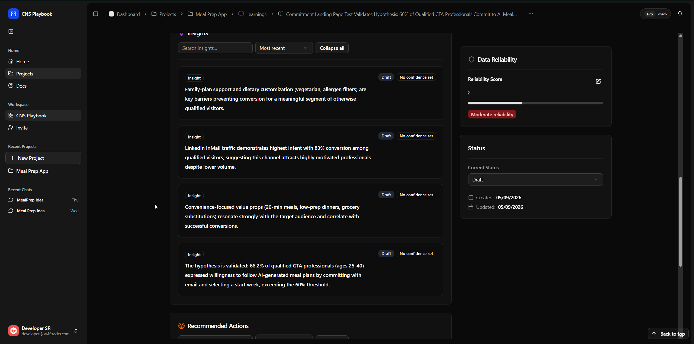
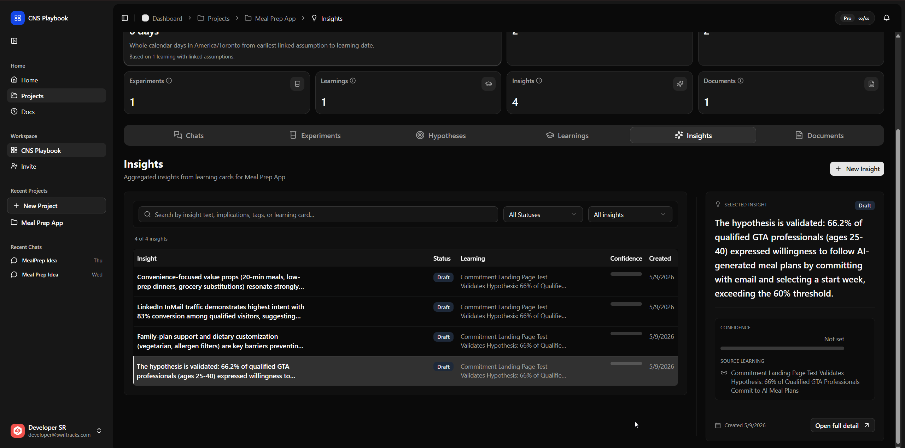
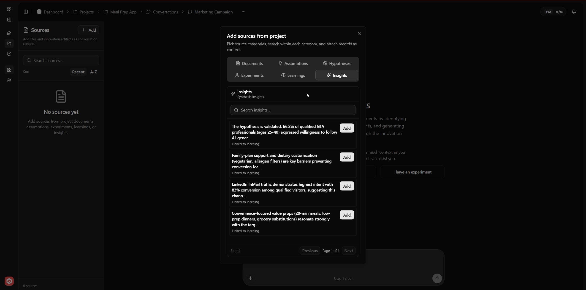

## Run sequence

1. [01 - Idea / Problem](01-idea-problem.md)
2. [02 - Identify Critical Assumptions](02-identify-critical-assumptions.md)
3. [03 - Form Testable Hypotheses](03-form-testable-hypotheses.md)
4. [04 - Design and Run Experiments](04-design-run-experiments.md)
5. [05 - Extract Key Learnings and Insights](05-extract-key-learnings.md)

## System map

## Quality bar for each run

- One critical assumption is explicitly selected.
- Hypothesis is testable and tied to clear success/invalidation signals.
- Experiment has owner, timeline, and data tracker plan.
- Learning draft separates observation from interpretation.
- Insight is reusable in future conversations through Sources.

## What strong execution looks like

- Teams keep scope tight early, then widen only when evidence supports it.
- EMS is used as a coordination surface, not just a record-keeping surface.
- Data tracker design is intentional, so synthesis quality is predictable.
- Learning drafts are treated as review artifacts, not automatic truth.
- Sources are actively reused so each cycle starts from stronger context.

## Definition of done

- Team can move from first login to first insight without skipping quality gates.
- Team can restart the next cycle using prior artifacts as Sources.

## Next step

Start with [01 - Idea / Problem](01-idea-problem.md).
