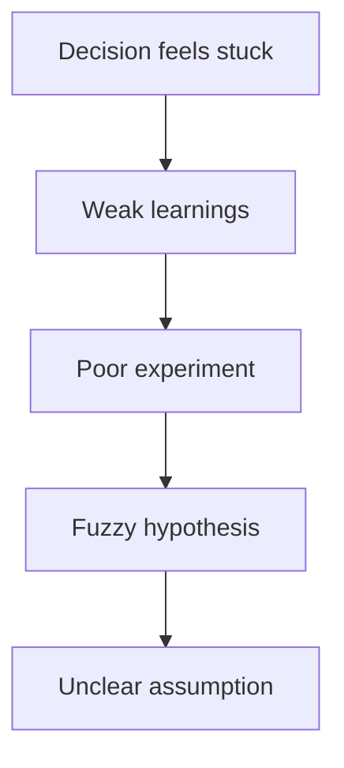

# Troubleshooting and Recovery

**Purpose**: Diagnose slow cycles and recover quickly without sacrificing quality.

This page exists because no team runs clean cycles all the time. The goal is not to avoid all breakdowns. The goal is to recognize them early enough that they do not keep compounding.

## Common blockers

- Unclear assumptions.
- Weak or non-testable hypotheses.
- Experiments with no usable evidence.
- Learnings captured as opinions.
- Decision meetings without decisions.

## How to diagnose where the problem really is

When a cycle feels stuck, teams often focus on the most visible symptom. That can be misleading.

In other words, if the decision meeting is going nowhere, the real issue may be weak learnings. If the learnings feel weak, the real issue may be a poor experiment. If the experiment feels noisy, the real issue may be a fuzzy hypothesis. And if the hypothesis is fuzzy, the real issue may be an unclear assumption.

That is why recovery should begin by locating the first weak checkpoint, not just the latest visible problem.

## Recovery sequence

1. Identify the failed checkpoint in the cycle.
2. Use the relevant quality standard or rubric.
3. Redefine owner, timeline, and expected output.
4. Re-run only the minimum required step.

## Branching recovery logic

### If the team is unclear about what it is testing

Return to assumption selection and tighten scope.

### If the team is active but not learning

Review the hypothesis and experiment criteria. This is often experiment theater.

### If the team has data but weak conclusions

Rework the learning capture step and use the rubric before moving to synthesis.

### If the team keeps discussing but not deciding

Use the decision checklist and force clarity on confidence, trade-offs, ownership, and next move.

The important point is that each branch sends the team to the smallest meaningful correction. Recovery should tighten the loop, not restart the whole project unless the team truly discovered the original frame was wrong.

## Escalate when

- A team misses two consecutive cycle checkpoints.
- Confidence remains low after repeated tests.
- Decisions are repeatedly deferred.

## Recovery mindset

The best recovery conversations are specific and non-dramatic. Avoid broad statements like “the whole process is broken.” Instead ask:

- What stage weakened first?
- What artifact is not good enough yet?
- What is the smallest correction that would restore clarity?

That keeps recovery practical and helps teams regain momentum faster.

## Next step

Return to [Run Learning Cycles in SwiftCNS](../run-learning-cycles/index.md) and apply the smallest fix that restores clarity.
